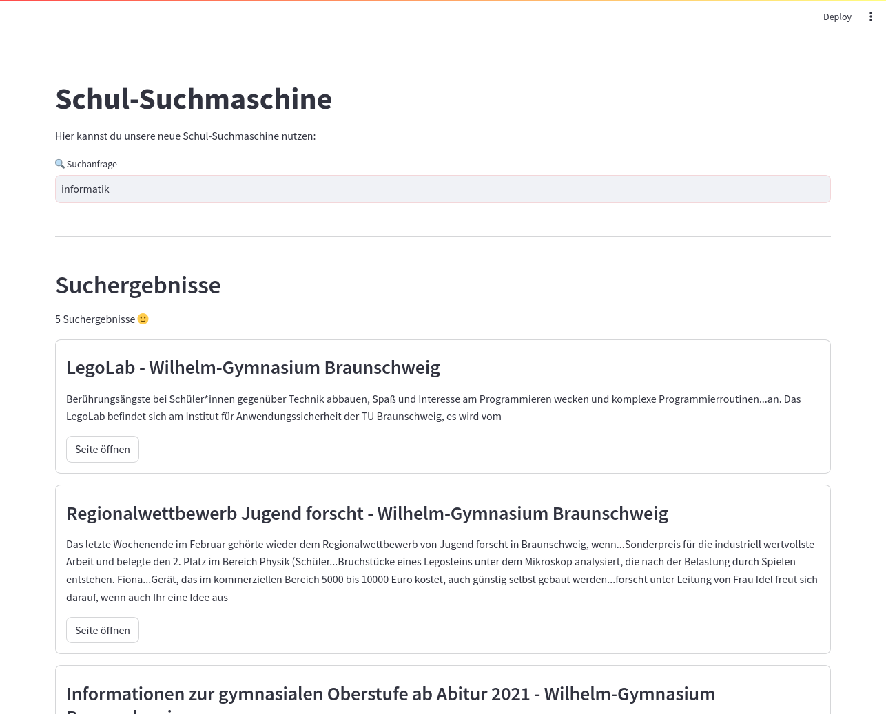
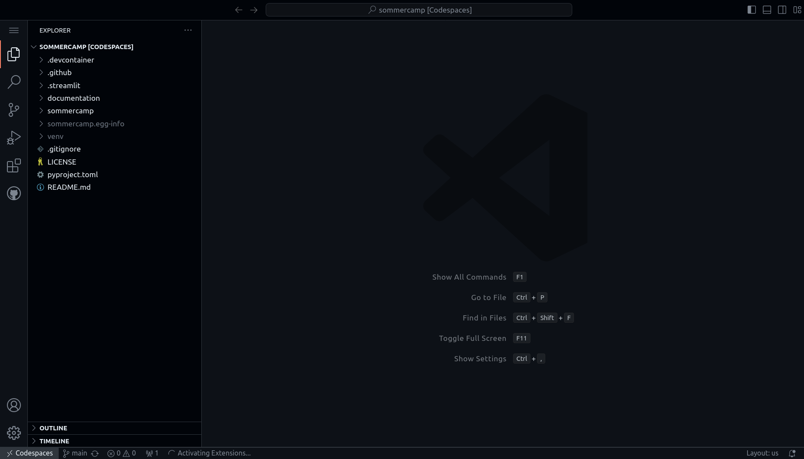
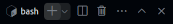
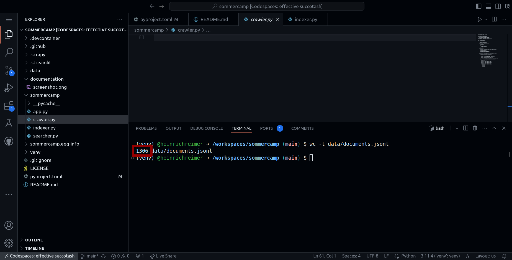
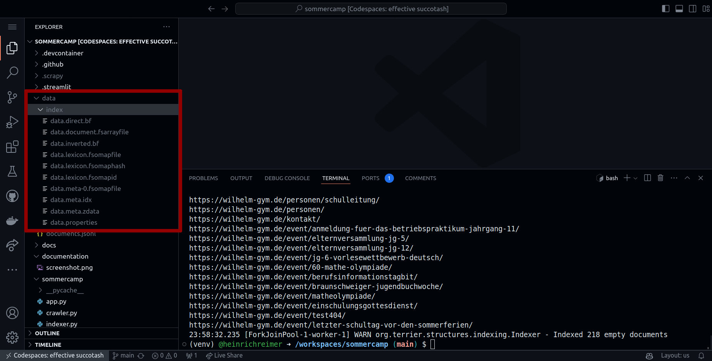
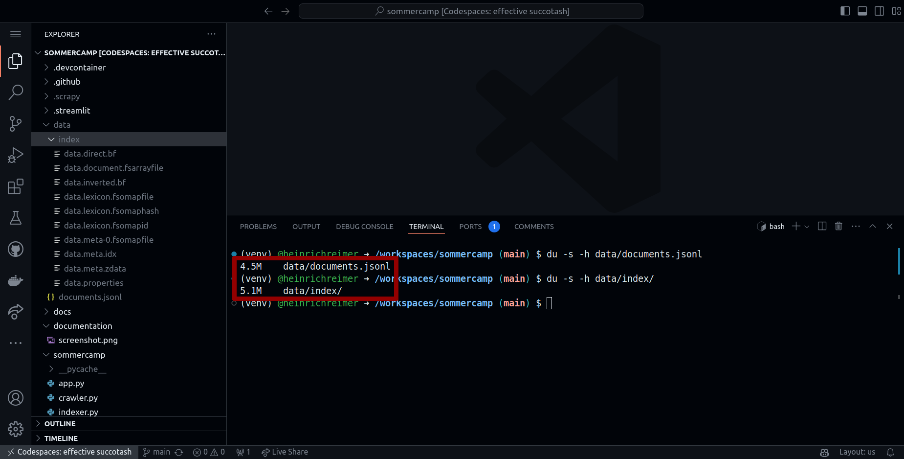
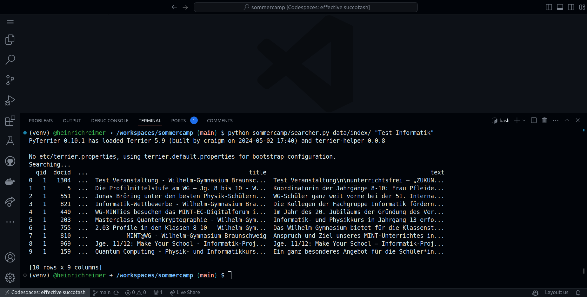
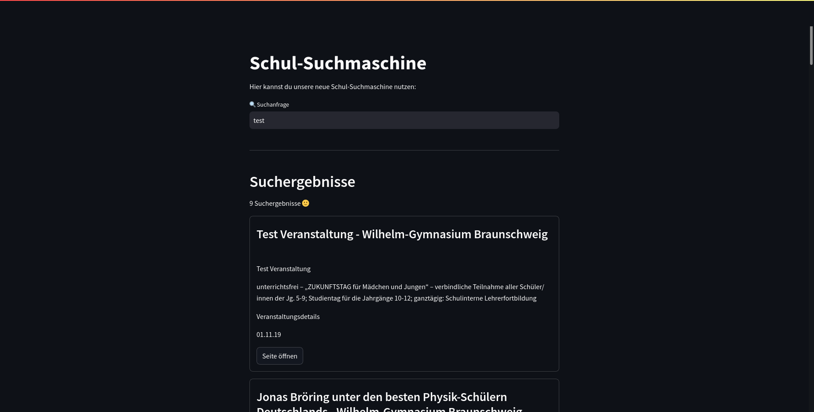
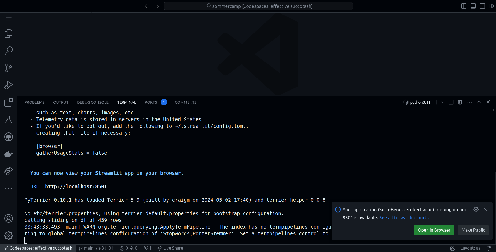

# 🏕️ sommercamp

Baue dir deine eigene Suchmaschine.

[](https://github.com/codespaces/new/webis-de/sommercamp?quickstart=1)

Dieser Workshop zum wurde entwickelt von der [Webis-Gruppe](https://webis.de/) für Schüler:innen ab 14 Jahren. Er findet beispielsweise beim [Informatik Sommercamp](https://sommercamp.uni-jena.de/) der [Friedrich-Schiller-Universität Jena](https://uni-jena.de/) statt.

<small>Tipp: Wir bieten auch einen inhaltsgleichen [englischen Kurs](https://github.com/webis-de/summercamp) an.</small>

<details>
<summary>Screenshot der Suchmaschine</summary>



</details>

## Installation

Um die Suchmaschine zu bauen, musst du zunächst einige Programme und Software-Bibliotheken installieren.
Diese brauchst du im späteren Verlauf.

**Fertige Entwicklungsumgebung**
Am einfachsten startest du mit einer fertigen Entwicklungsumgebung, wo alles bereits installiert ist oder automatisch nach installiert wird.

Klicke dazu auf die folgende Schaltfläche:

[](https://github.com/codespaces/new/webis-de/sommercamp?quickstart=1)

In dem Fenster, das sich dann öffnet, hast du zwei Optionen:

1. Wähle entweder eine schon laufende Entwicklungsumgebung aus (falls du vorher schon eine erstellt hattest).
2. Oder klicke auf die grüne Schaltfläche <kbd>Create new codespace</kbd>, um eine neue Entwicklungsumgebung zu erstellen.

Es öffnet sich ein Browser-Fenster mit der Entwicklungsumgebung.
Warte bitte eine Weile (bis zu 5 Minuten), bis keine Fortschrittsanzeigen mehr zu sehen sind. Solange werden noch automatisch alle benötigten Software-Bibliotheken installiert.

Dein Browserfenster sollte nun in etwa so aussehen und eine Liste mit Dateien anzeigen:


_Tipp:_ Falls du später Software-Abhängigkeiten veränderst, kannst du die Software-Bibliotheken jederzeit neu installieren. Öffne dazu zuerst eine Kommandozeile in der Entwicklungsumgebung.

Klicke dazu auf die drei Striche () und dann im Menü "Terminal" auf "New Terminal". Es öffnet sich nun eine Kommandozeile im unteren Bereich des Bildschirms.

Dort gib folgendes ein, um die benötigte Software neu zu installieren:

```shell
pip install -e ./
```

<details><summary><strong>Manuelle Installation</strong></summary>

_Wichtig:_ Die Anleitung zur manuellen Installation ist etwas für erfahrenere Progrmmierer.
Normalerweise solltest du lieber die fertige Entwicklungsumgebung benutzen, wie oben beschrieben.
In den folgenden Abschnitten gehen wir davon aus, dass du ein Linux-Betriebssystem hast. Wenn du ein anderes Betriebssystem hast, frag bitte nach.

Zur manuellen Installation, lade dir zuerst [Python 3.11](https://python.org/downloads/) herunter und installiere es auf deinem PC.

Dann kannst du eine virtuelle Umgebung erstellen. So kannst du Software installieren, ohne andere Programme auf deinem Computer zu beeinflussen. Öffne dazu die Kommandozeile deines PCs in diesem Ordner und gib folgendes ein:

```shell
python3.11 -m venv ./venv/
```

Nachdem du so eine virtuelle Umgebung erstellt hast, musst du diese noch aktivieren:

```shell
source ./venv/bin/activate
```

Nun erscheint im Terminal vor jeder Eingabezeile die Bezeichnung `(venv)`, wodurch du siehst, dass die virtuelle Umgebung aktiviert ist.

Als letztes musst du noch die benötigten Software-Bibliotheken installieren:

```shell
pip install -e ./
```

</details><br>

Das wars, du kannst nun mit dem ["Crawlen"](#eine-webseite-crawlen) starten.

## Eine Webseite "crawlen"

Für deine Suchmaschine brauchst du zuerst eine Sammlung von Dokumenten, die du durchsuchen willst.

Bei Websuchmaschinen sind das eine oder mehrere Webseiten.
(Bei Google/Bing sind es fast alle bekannten Webseiten.)
Wir wollen aber klein starten und erstmal eine Webseite deiner Wahl durchsuchbar machen.
Wie wäre es denn zum Beispiel mit der Webseite deiner Schule, deines Sportvereins?

Wir wollen also den Text und ein paar zusätzliche Daten zu allen Seiten eines Webauftritts abspeichern. Das nennt man "Crawlen" und das Programm, was das tut, heißt "Crawler" oder "Spider" ([`Folien`](https://github.com/webis-de/sommercamp/blob/main/docs/folien-wie-funktioniert-eine-suchmaschine.pdf)).
Damit wir nicht alles von Null auf selbst programmieren müssen, nutzen wir die [Software-Bibliothek "Scrapy"](https://docs.scrapy.org/en/latest/index.html) für das Crawlen.

Erstelle eine neue neue Datei `crawler.py` im Verzeichnis `sommercamp/` und schreibe darin diesen Quellcode:

<details><summary><strong>Quellcode für <code>sommercamp/crawler.py</code></strong></summary>

```python
# Hier importieren wir die benötigten Softwarebibliotheken.
from resiliparse.extract.html2text import extract_plain_text
from scrapy import Spider, Request
from scrapy.linkextractors.lxmlhtml import LxmlLinkExtractor
from scrapy.http.response.html import HtmlResponse


class SchoolSpider(Spider):
    # Gib hier dem Crawler einen eindeutigen Name,
    # der beschreibt, was du crawlst.
    name = "school"

    start_urls = [
        # Gib hier mindestens eine (oder mehrere) URLs an,
        # bei denen der Crawler anfangen soll,
        # Seiten zu downloaden.
        "https://wilhelm-gym.de/",
    ]
    link_extractor = LxmlLinkExtractor(
        # Beschränke den Crawler, nur Links zu verfolgen,
        # die auf eine der gelisteten Domains verweisen.
        allow_domains=["wilhelm-gym.de"],
    )
    custom_settings = {
        # Identifiziere den Crawler gegenüber den gecrawlten Seiten.
        "USER_AGENT": "Sommercamp (https://uni-jena.de)",
        # Der Crawler soll nur Seiten crawlen, die das auch erlauben.
        "ROBOTSTXT_OBEY": True,
        # Frage zu jeder Zeit höchstens 4 Webseiten gleichzeitig an.
        "CONCURRENT_REQUESTS": 4,
        # Verlangsame den Crawler, wenn Webseiten angeben,
        # dass sie zu oft angefragt werden.
        "AUTOTHROTTLE_ENABLED": True,
        "AUTOTHROTTLE_TARGET_CONCURRENCY": 1,
        # Frage nicht zwei mal die selbe Seite an.
        "HTTPCACHE_ENABLED": True,
    }

    def parse(self, response):
        if not isinstance(response, HtmlResponse):
            # Die Webseite ist keine HTML-Webseite, enthält also keinen Text.
            return
        
        # Speichere die Webseite als ein Dokument in unserer Dokumentensammlung.
        yield {
            # Eine eindeutige Identifikations-Nummer für das Dokument.
            "docno": str(hash(response.url)),
            # Die URL der Webseite.
            "url": response.url,
            # Der Titel der Webseite aus dem <title> Tag im HTML-Code.
            "title": response.css("title::text").get(),
            # Der Text der Webseite.
            # Um den Hauptinhalt zu extrahieren, benutzen wir
            # eine externe Bibliothek.
            "text": extract_plain_text(response.text, main_content=True),
        }

        # Finde alle Links auf der aktuell betrachteten Webseite.
        for link in self.link_extractor.extract_links(response):
            if link.text == "":
                # Ignoriere Links ohne Linktext, z.B. bei Bildern.
                continue
            # Für jeden gefundenen Link, stelle eine Anfrage zum Crawling.
            yield Request(link.url, callback=self.parse)
```

</details><br>

Alle Zeilen, die mit einem `#` beginnen, sind Kommentare. Diese Zeilen brauchst du nicht abschreiben, sondern kannst sie weglassen.
Dabei solltest du einige Dinge beachten:

- _Name_: Gib deinem Crawler einen Namen (`name`), der nur aus Buchstaben besteht, z.B., `"school"`.
- _Start-URLs_: Damit der Crawler die ersten Links finden kann, gib mindestens eine URL für den Start an (`start_urls`).
- _Link-Einstellungen_: Für das Auslesen neuer Links, konfiguriere den Link-Extraktor (`link_extractor`). Zum Beispiel, kannst du das Crawling auf Domains beschränken.
- _Weitere Einstellungen_: Außerdem sind noch weitere Einstellungen wichtig (`custom_settings`). Wir wollen "höflich" sein und keine Webseite mit Anfragen überlasten. Dazu identifiziert sich der Crawler (`"USER_AGENT"`) und stellt nur begrenzt viele Anfragen gleichzeitig (`"CONCURRENT_REQUESTS"`).
- _Dokument speichern_: Wir speichern für jede Webseite ein Dokument ab (`yield { ... }`), bei dem wir den Text und andere Metadaten in einem "Dictionary" abspeichern. Gib dabei eine eindeutige Dokumentenkennung (`"docno"`), die URL (`"url"`), den Titel (`"title"`) und den Inhalt (`"text"`) der Webseite an.
- _Links verfolgen_: Um weitere, verlinkte Webseiten zu Crawlen stelle eine neue Anfrage `Request` für jeden Link, den der Link-Extraktor gefunden hat.

Nun kannst du den Crawler starten.
Öffne dazu zuerst eine Kommandozeile in der Entwicklungsumgebung.

Klicke dazu auf die drei Striche () und dann im Menü "Terminal" auf "New Terminal". Es öffnet sich nun eine Kommandozeile im unteren Bereich des Bildschirms.

Dort tippe folgendes ein:

```shell
scrapy runspider sommercamp/crawler.py --output data/documents.jsonl
```

Die Zeile startet den Crawler und fängt an, die gecrawlten Dokumente (Webseiten-Inhalte) in die Datei [`documents.jsonl`](data/documents.jsonl) im Verzeichnis `data/` zu schreiben. Schau gerne mal rein, indem du [hier](data/documents.jsonl) klickst. Was komisch aussieht, ist ein strukturiertes Datenformat, bei dem in jeder Zeile ein Dokument steht.

Du kannst die Anzahl der Dokumente jederzeit zählen, indem du zuerst ein weiteres Terminal öffnest (Plus-Symbol in der Terminal-Ansicht; ) und dann folgendes eintippst:

```shell
wc -l data/documents.jsonl
```



Die Zahl in der Ausgabe gibt an, wie viele Dokumente du bisher gecrawlt hast.

## Die heruntergeladenen Webseiten indizieren

Damit die heruntergeladenen Webseiten durchsuchbar werden, müssen wir daraus einen "invertierten Index" erstellen ([`Folien`](https://github.com/webis-de/sommercamp/blob/main/docs/folien-indexing.pdf)).

Dazu benutzen wir wieder eine Software-Bibliothek, [PyTerrier](https://pyterrier.readthedocs.io/en/latest/terrier-indexing.html).

Erstelle eine neue neue Datei `indexer.py` im Verzeichnis `sommercamp/` und schreibe darin diesen Quellcode:

<details><summary><strong>Quellcode für <code>sommercamp/indexer.py</code></strong></summary>

```python
# Hier importieren wir die benötigten Softwarebibliotheken.
from os.path import exists, abspath
from json import loads
from shutil import rmtree
from sys import argv
from pyterrier import started, init
# Die PyTerrier-Bibliothek muss zuerst gestartet werden,
# um alle seine Bestandteile importieren zu können.
if not started():
    init()
from pyterrier.index import IterDictIndexer


# Diese Funktion liest jedes Dokument aus der Dokumenten-Sammlung ein
# und gibt es als Python-Objekt zurück.
def iterate_documents(documents_file):
    # Öffne die Datei (Dateiname aus `documents_file`) im Lesemodus.
    with open(documents_file, "rt") as lines:
        # Schleife, die jede Zeile einzeln einliest.
        for line in lines:
            # Lade das Dokument aus der Zeile als Python-Objekt.
            document = loads(line)
            # Gib die URL im Terminal aus, sodass du
            # den Fortschritt beim Indizieren siehst.
            print(document["url"])
            yield document


# Diese Funktion indiziert die Dokumente aus der Dokumenten-Sammlung
# und speichert den Index an der angegebenen Stelle ab.
def index(documents_file, index_dir):
    # Erzeuge hier den Indexer von PyTerrier.
    indexer = IterDictIndexer(
        # Der Pfad, wo der Index gespeichert werden soll.
        abspath(index_dir),
        # Die maximale Länge in Buchstaben für jedes Feld im Index.
        # (Die Werte unten sollten locker reichen.)
        meta={
            "docno": 100,
            "url": 1000,
            "title": 1000,
            "text": 100_000,
        },
    )
    # Starte das Indizieren.
    indexer.index(iterate_documents(documents_file))


# Die Hauptfunktion, die beim Ausführen der Datei aufgerufen wird.
def main():
    # Lade den Pfad zur Dokumenten-Sammlung aus dem
    # ersten Kommandozeilen-Argument.
    documents_file = argv[1]
    # Lade den Pfad zum Index aus dem zweiten Kommandozeilen-Argument.
    index_dir = argv[2]

    # Wenn du schon vorher etwas indiziert hattest, lösche den alten Index.
    if exists(index_dir):
        rmtree(index_dir)

    # Rufe die Index-Funktion von oben auf.
    index(documents_file, index_dir)


if __name__ == "__main__":
    main()
```

</details><br>

Das Python-Programm zum Indexer kannst du dann ausführen, indem du folgendes in dein Terminal eintippst:

```shell
python sommercamp/indexer.py data/documents.jsonl data/index/
```

Wenn du nun einmal in das [Daten-Verzeichnis](data/) guckst, siehst du, dass dort ein neues [Verzeichnis `data/index/`](data/index/) angelegt wurde, in dem sich der Index befindet.



Leider kannst du in diese Index-Dateien nicht rein gucken, weil es Binärdateien sind (bestehend nur aus Einsen und Nullen).
Du kannst aber mit diesen Befehlen im Terminal vergleichen, wie viel Speicherplatz der Index im Vergleich zur Dokumentensammlung verbraucht:

```shell
du -s -h data/documents.jsonl
du -s -h data/index/
```



Tatsächlich ist der invertierte Index ungefähr so groß wie die gecrawlte Dokumenten-Sammlung.

## Im Index suchen

Jetzt wird es richtig spannend: Wir wollen in dem gerade erstellten Index nach Suchbegriffen suchen.

Damit die Suche mit deinem Index kompatibel ist, verwenden wir wieder die gleiche Software-Bibliothek, [PyTerrier](https://pyterrier.readthedocs.io/en/latest/terrier-retrieval.html).

Erstelle nun eine neue Datei `searcher.py` im Verzeichnis `sommercamp/` und schreibe darin diesen Quellcode:

<details><summary><strong>Quellcode für <code>sommercamp/searcher.py</code></strong></summary>

```python
# Hier importieren wir die benötigten Softwarebibliotheken.
from os.path import exists, abspath
from sys import argv
from pyterrier import started, init
# Die PyTerrier-Bibliothek muss zuerst gestartet werden,
# um alle seine Bestandteile importieren zu können.
if not started():
    init()
from pyterrier import IndexFactory
from pyterrier.batchretrieve import BatchRetrieve
from pyterrier.text import get_text


# In dieser Funktion öffnen wir den Index und suchen darin 
# nach der gegebenen Suchanfrage ("query").
def search(index_dir, query):
    # Öffne den Index.
    index = IndexFactory.of(abspath(index_dir))
    # Initialisiere den Such-Algorithmus. 
    searcher = BatchRetrieve(
        index,
        # Der bekannteste Suchalgorithmus heißt "BM25".
        wmodel="BM25",
        # Und es sollen bis zu 10 Ergebnisse zurückgegeben werden.
        num_results=10,
    )
    # Initialisiere ein Modul, was den Text 
    # der gefundenen Dokumente aus dem Index lädt.
    text_getter = get_text(index, metadata=["url", "title", "text"])
    # Baue nun die "Pipeline" für die Suche zusammen: 
    # Zuerst suchen, dann Text abrufen.
    pipeline = searcher >> text_getter
    # Führe die Such-Pipeline aus und suche nach der Suchanfrage (query).
    results = pipeline.search(query)
    return results


# Die Hauptfunktion, die beim Ausführen der Datei aufgerufen wird.
def main():
    # Lade den Pfad zum Index aus dem ersten Kommandozeilen-Argument.
    index_dir = argv[1]
    # Lade die Suchanfrage aus dem zweiten Kommandozeilen-Argument.
    query = argv[2]

    # Wenn es noch keinen Index gibt, können wir nichts zurückgeben.
    if not exists(index_dir):
        exit(1)

    print("Searching...")
    # Rufe die Such-Funktion von oben auf.
    results = search(index_dir, query)
    # Gib die Suchergebnisse im Terminal aus.
    print(results)

if __name__ == "__main__":
    main()
```

</details><br>

Noch ist deine Suchmaschine nicht besonders hübsch, aber dennoch voll funktionabel. Du kannst das Python-Programm zum Suchen so im Terminal ausführen:

```shell
python sommercamp/searcher.py data/index/ "Test Informatik"
```

Achte dabei darauf, dass du deinen Suchbegriff zwischen Anführungszeichen (`"`) setzt. Nur so kannst du Suchanfragen aus mehreren Wörtern stellen.



Im Terminal siehst du jetzt die ersten zehn Suchergebnisse, die der Such-Algorithmus (BM25) zu deiner Suchanfrage gefunden hat.
(Wenn dir etwas wie `Empty DataFrame` zurückgegeben wird, dann bedeutet das, dass keine Ergebnisse gefunden werden konnten. Probiere einfach einen anderen Suchbegriff.)
Noch ist außerdem der Titel und der Text abgeschnitten und auch sonst ist die kleine Suchmaschine noch nicht besonders benutzerfreundlich. Das wollen wir im nächsten Schritt verbessern.

## Eine Benutzeroberfläche für die Suchmaschine erstellen

Um deine Suchmaschine komplett zu machen, fehlt noch eine schöne Benutzeroberfläche.
Du ahnst es vielleicht schon: Wir erfinden das Rad wieder nicht neu, sondern benutzen wieder eine Software-Bibliothek, [Streamlit](https://docs.streamlit.io/).

Mit Streamlit kannst du ganz einfach eine Web-App aus deinem Python-Programm machen.
Erstelle dazu eine neue neue Datei `app.py` im Verzeichnis `sommercamp/` und schreibe darin diesen Quellcode:

<details><summary><strong>Quellcode für <code>sommercamp/app.py</code></strong></summary>

```python
# Hier importieren wir die benötigten Softwarebibliotheken.
from os.path import abspath, exists
from sys import argv
from streamlit import (text_input, header, title, subheader, 
    container, markdown, link_button, divider, set_page_config)
from pyterrier import started, init
# Die PyTerrier-Bibliothek muss zuerst gestartet werden,
# um alle seine Bestandteile importieren zu können.
if not started():
    init()
from pyterrier import IndexFactory
from pyterrier.batchretrieve import BatchRetrieve
from pyterrier.text import get_text


# Diese Funktion baut die App für die Suche im gegebenen Index auf.
def app(index_dir) -> None:

    # Konfiguriere den Titel der Web-App (wird im Browser-Tab angezeigt)
    set_page_config(
        page_title="Schul-Suchmaschine",
        page_icon="🔍",
        layout="centered",
    )

    # Gib der App einen Titel und eine Kurzbeschreibung:
    title("Schul-Suchmaschine")
    markdown("Hier kannst du unsere neue Schul-Suchmaschine nutzen:")

    # Erstelle ein Text-Feld, mit dem die Suchanfrage (query) 
    # eingegeben werden kann.
    query = text_input(
        label="🔍 Suchanfrage",
        placeholder="Suche...",
        value="Schule",
    )

    # Wenn die Suchanfrage leer ist, dann kannst du nichts suchen.
    if query == "":
        markdown("Bitte gib eine Suchanfrage ein.")
        return

    # Öffne den Index.
    index = IndexFactory.of(abspath(index_dir))
    # Initialisiere den Such-Algorithmus. 
    searcher = BatchRetrieve(
        index,
        wmodel="BM25",
        num_results=10,
    )
    # Initialisiere das Modul, zum Abrufen der Texte.
    text_getter = get_text(index, metadata=["url", "title", "text"])
    # Baue die Such-Pipeline zusammen.
    pipeline = searcher >> text_getter
    # Führe die Such-Pipeline aus und suche nach der Suchanfrage.
    results = pipeline.search(query)

    # Zeige eine Unter-Überschrift vor den Suchergebnissen an.
    divider()
    header("Suchergebnisse")

    # Wenn die Ergebnisliste leer ist, gib einen Hinweis aus.
    if len(results) == 0:
        markdown("Keine Suchergebnisse 🙁")
        return

    # Wenn es Suchergebnisse gibt, dann zeige an, wie viele.
    markdown(f"{len(results)} Suchergebnisse 🙂")

    # Gib nun der Reihe nach, alle Suchergebnisse aus.
    for _, row in results.iterrows():
        # Pro Suchergebnis, erstelle eine Box (container).
        with container(border=True):
            # Zeige den Titel der gefundenen Webseite an.
            subheader(row["title"])
            # Zeige den Anfang (erste 1000 Zeichen) des Webseiten-Texts an.
            markdown(row["text"][:1000])
            # Gib Nutzern eine Schaltfläche, um die Seite zu öffnen.
            link_button("Seite öffnen", url=row["url"])


# Die Hauptfunktion, die beim Ausführen der Datei aufgerufen wird.
def main():
    # Lade den Pfad zum Index aus dem ersten Kommandozeilen-Argument.
    index_dir = argv[1]

    # Wenn es noch keinen Index gibt, kannst du die Suchmaschine nicht starten.
    if not exists(index_dir):
        exit(1)

    # Rufe die App-Funktion von oben auf.
    app(index_dir)


if __name__ == "__main__":
    main()
```

</details><br>

Deine Web-App startest du mit dem folgenden Befehl im Terminal:

```shell
streamlit run sommercamp/app.py -- data/index/
```

(Das Terminal fragt beim ersten mal nach einer E-Mail. Das kannst du ignorieren und einfach <kbd>Enter</kbd> drücken.)

Et voilà! Es öffnet sich ein neuer Browser-Tab mit deiner selbstgemachten Suchmaschine.



Probier doch direkt mal verschiedene Suchbegriffe aus. Was würdest du verbessern wollen?

> TODO: Wooclap or similar for feature ideas.

Eine Suchmaschine ist natürlich erst richtig sinnvoll, wenn auch andere sie nutzen können, oder?

Gib deine Suchmaschine frei, indem du in dem Pop-up in der Entwicklungsumgebung auf "Make Public" klickst.



Wechsle dann wieder auf den Tab mit deiner Suchmaschine und kopiere die URL aus der Adresszeile des Browsers.

> TODO: Public Google Doc with URLs to search engines.

Diese URL kannst du in [dieses geteilte Dokument](#TODO) kopieren, um sie mit den anderen Teilnehmenden des Sommercamps teilen. Klicke dann auf eine beliebige andere URL zu der Suchmaschine einer/eines anderen Teilnehmenden. Was würdest du hier verbessern wollen?

> TODO: Wooclap or similar for feature ideas.

Da haben wir doch einige Ideen für Verbesserungen und Extras gesammelt.

## Extras

Einige weitere Ideen haben wir euch auch noch mitgebracht:

| Beschreibung | Schwierigkeit | Link |
|:--|:-:|:-:|
| Design der Benutzeroberfläche anpassen | leicht | [🔗](https://docs.streamlit.io/library/advanced-features/theming) |
| Komponenten für die Benutzeroberfläche anpassen | leicht | [🔗](https://docs.streamlit.io/library/api-reference) |
| Emojis einbinden | leicht | [🔗](https://share.streamlit.io/streamlit/emoji-shortcodes) |
| Mehr als 10 Ergebnisse mit Seitennummerierung anzeigen | mittel | [🔗](https://github.com/Socvest/streamlit-pagination) / [🔗](https://medium.com/streamlit/paginating-dataframes-with-streamlit-2da29b080920) |
| Inhaltsbezogene Kurz-Zusammenfassungen ("Snippets") anzeigen statt gekürztem Volltext | schwierig | [🔗](https://pyterrier.readthedocs.io/en/latest/text.html#query-biased-summarisation-snippets) |
| Auto-Vervollständigung in der Such-Leiste| schwierig | [🔗](https://github.com/m-wrzr/streamlit-searchbox) |

Nimm dir nun für den zweiten Tag im Sommercamp ein "Extra" vor und versuche dieses in die Suchmaschinen-Web-App mit einzubauen.

> TODO: When should we do the second feedback round?

Nach dem Mittagessen wollen wir noch einmal jeweils eine andere Suchmaschine anschauen. Öffne dazu noch einmal das [geteilte Dokument](#TODO) mit den gesammelten URLs. Klicke wieder auf eine zufällige andere URL zu der Suchmaschine einer/eines anderen Teilnehmenden. Nachdem ihr alle eine Weile an euren Suchmaschinen gearbeitet habt, was würdest du nun verbessern wollen?

> TODO: Wooclap or similar for feature ideas.

## Lernziele

> TODO: Should we ask some knowledge on search or search engines upfront and after the workshop to have some feedback on the main learning effects?

## Für Lehrende

<details><summary><strong>Hinweise nur für Lehrende</strong></summary>

Dieses Code-Repository richtet sich an Schüler:innen ab Klasse **TODO**. Wir geben uns Mühe, die Inhalte so einfach wie möglich darzustellen, aber natürlich gibt es noch Raum für Verbesserungen. Wenn du selbst Lehrer:in oder Dozent:in bist, kannst du uns helfen, indem du uns entweder [Ideen oder Wünsche schreibst](https://github.com/webis-de/sommercamp/issues/new) oder selbst bei der Entwicklung unterstützt.
Dazu erläutern wir im Folgenden die Grundstruktur des Code-Repositorys.

> TODO: Prepare branches.

Das Repository ist in verschiedene Branches aufgeteilt, die den Start "von Null auf" und die vier Teilziele des Sommercamp-Workshops darstellen:

- `main`: Start "von Null auf", der normale Ablauf des Workshops.
- `crawler`: Fertige Crawler-Implementation, falls Schüler:innen beim Programmieren des Crawlers nicht mitkommen.
- `indexer`: Fertige Indexer-Implementation, falls Schüler:innen beim Programmieren des Indexers nicht mitkommen.
- `searcher`: Fertige Suche-Implementation, falls Schüler:innen beim Programmieren des Such-Algorithmus' nicht mitkommen.
- `app`: Fertige App-Implementation der Web-Oberfläche für die Suchmaschine, falls Schüler:innen beim Programmieren der App nicht mitkommen.

Außer des `main` Branches, der den regulären Start des Workshops darstellt, sind die restlichen vier Branches so angelegt, dass Schüler:innen jederzeit durch Mergen auf den jeweils nächsten Implementierungsstand springen können, falls sie sonst den Anschluss an andere Workshop-Teilnehmende verlieren.

(Weitere Branches enthalten Implementierungsideen und Extras, die schnelle Schüler:innen individuell implementieren können: **TODO: Liste**)

Die vier Teilziele finden sich außerdem in der Benennung der Dateien im Python-Modul `sommercamp` wieder.

Wir bitten dich, bei neuen Beiträgen zu diesem Repository, Bezeichner im Code (Variablennamen, Klassen, etc.) mit englischen Namen zu bennenen, aber erklärende Kommentare in deutsch zu verfassen, damit auch Schüler:innen aus früheren Klassenstufen die Inhalte grob verstehen können.

</details><br>

## Lizenz

Der Quellcode in diesem Repostitory ist unter der [MIT Lizenz](https://choosealicense.com/licenses/mit/) lizensiert. Kursinhalte werden unter der [CC BY 4.0 Lizenz](https://creativecommons.org/licenses/by/4.0/) zur Verfügung gestellt.
Bitte verweise auf dieses Repository, wenn du Inhalte daraus verwendest.
